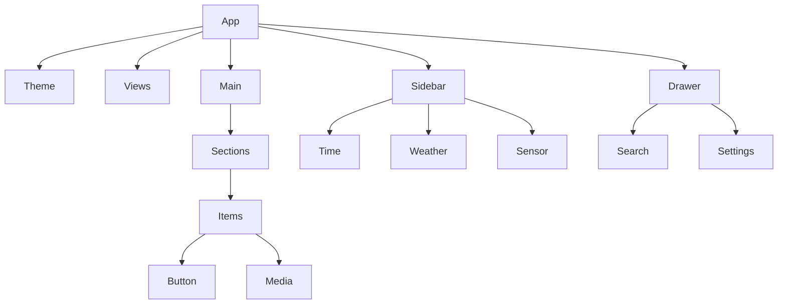

# HA-Fusion Component Architecture Guide

## Overview

This comprehensive guide documents the component architecture, implementation patterns, and extensibility mechanisms of HA-Fusion. Understanding this architecture is essential for developers, contributors, and advanced users who want to customize or extend the platform.

## Table of Contents

1. [Architecture Overview](#architecture-overview)
2. [Core Components](#core-components)
3. [Component Hierarchy](#component-hierarchy)
4. [State Management](#state-management)
5. [Component Types](#component-types)
6. [Dashboard Components](#dashboard-components)
7. [Sidebar Components](#sidebar-components)
8. [Modal Components](#modal-components)
9. [Utility Components](#utility-components)
10. [Custom Component Development](#custom-component-development)
11. [Plugin Architecture](#plugin-architecture)
12. [Integration Patterns](#integration-patterns)
13. [Performance Considerations](#performance-considerations)
14. [Testing Components](#testing-components)
15. [Best Practices](#best-practices)

## Architecture Overview

### Technology Stack

HA-Fusion is built using modern web technologies:

| Technology | Purpose | Version |
|------------|---------|---------|
| **SvelteKit** | Full-stack framework | 2.6.4+ |
| **Svelte** | Component framework | 4.2.19+ |
| **TypeScript** | Type safety | 5.6.3+ |
| **Vite** | Build tool | 5.4.8+ |
| **Node.js** | Runtime environment | 18+ |

### Application Structure

```
src/
├── app.html                 # HTML template
├── hooks.server.ts          # Server hooks
├── global.d.ts             # Global type definitions
├── lib/                    # Core library
│   ├── Components/         # Reusable components
│   ├── Drawer/            # Navigation drawer
│   ├── Main/              # Main content area
│   ├── Modal/             # Modal dialogs
│   ├── Settings/          # Settings components
│   ├── Sidebar/           # Sidebar components
│   ├── Socket.ts          # WebSocket integration
│   ├── Stores.ts          # State management
│   └── Types.ts           # Type definitions
└── routes/                # SvelteKit routes
    ├── +page.svelte       # Main application
    ├── +page.server.ts    # Server-side logic
    └── _api/              # API endpoints
```

### Component Architecture Principles

1. **Component Composition**: Small, focused components that compose into larger features
2. **Reactive State**: Svelte stores for reactive state management
3. **Type Safety**: Full TypeScript integration for type safety
4. **Modularity**: Clear separation of concerns and modular design
5. **Performance**: Lazy loading and efficient rendering
6. **Extensibility**: Plugin architecture for custom components

## Core Components

### Application Root

#### +page.svelte
The main application component that orchestrates the entire interface.

```typescript
// Key responsibilities:
// - Authentication management
// - WebSocket connection handling
// - Global event handling
// - Component lazy loading
// - Layout management

export let data; // Server-side data

// Core stores
$configuration = data?.configuration;
$dashboard = data?.dashboard;
$translation = data?.translations;
```

**Key Features:**
- Dynamic component loading
- Keyboard shortcut handling
- Authentication flow management
- Responsive layout control

#### Component Loading Pattern

```svelte
<!-- Lazy loading pattern used throughout -->
{#await import('$lib/Main/Index.svelte') then Main}
  <svelte:component this={Main.default} {view} {altKeyPressed} />
{/await}
```

### Layout Components

#### Layout Grid System

```css
#layout {
  display: grid;
  grid-template-areas:
    'header header'
    'aside nav'
    'aside main';
  min-height: 100vh;
  overflow: hidden;
}

@media (max-width: 768px) {
  #layout {
    grid-template-areas:
      'header header'
      'aside aside'
      'nav nav'
      'main main';
  }
}
```

## Component Hierarchy

### Top-Level Structure

```
App (+page.svelte)
├── Theme (Theme.svelte)
├── Views (Main/Views.svelte)
├── Main Content
│   ├── Index (Main/Index.svelte)
│   └── Intro (Main/Intro.svelte)
├── Sidebar (Sidebar/Index.svelte)
├── Drawer
│   ├── MenuButton (Drawer/MenuButton.svelte)
│   └── Index (Drawer/Index.svelte)
└── CustomJs (Components/CustomJs.svelte)
```

### Component Dependencies



## State Management

### Svelte Stores Architecture

HA-Fusion uses Svelte stores for centralized state management:

```typescript
// src/lib/Stores.ts

// Configuration state
export const configuration = writable<Configuration>({});
export const dashboard = writable<Dashboard>({ views: [], sidebar: [] });

// UI state
export const editMode = writable<boolean>(false);
export const showDrawer = writable<boolean>(false);
export const currentViewId = writable<number | undefined>();

// Home Assistant integration
export const states = writable<HassEntities>({});
export const connection = writable<Connection | undefined>();
export const connected = writable<boolean>(false);

// Theme and localization
export const selectedLanguage = writable<string>('en');
export const translation = writable<Translations>({});
```

### Store Usage Patterns

#### Reactive Subscriptions

```svelte
<script>
  import { states, configuration } from '$lib/Stores';
  
  // Reactive statement
  $: entityState = $states[entity_id];
  
  // Derived store
  const isOn = derived(states, ($states) => 
    $states[entity_id]?.state === 'on'
  );
</script>
```

#### Store Updates

```typescript
// Update configuration
configuration.update(config => ({
  ...config,
  locale: 'sv'
}));

// Set dashboard
dashboard.set(newDashboard);

// Update specific entity state
states.update(currentStates => ({
  ...currentStates,
  [entity_id]: newState
}));
```

### State Persistence

```typescript
// Automatic persistence for configuration
configuration.subscribe(async (config) => {
  if (browser && Object.keys(config).length > 0) {
    await fetch('/_api/save_config', {
      method: 'POST',
      headers: { 'Content-Type': 'application/json' },
      body: JSON.stringify(config)
    });
  }
});
```

## Component Types

### Dashboard Item Components

#### Button Component

```typescript
// Button component interface
interface ButtonItem {
  type: 'button';
  id: number;
  entity_id: string;
  name?: string;
  icon?: string;
  color?: string;
  marquee?: boolean;
  more_info?: boolean;
  service?: string;
  template?: TemplateConfig;
}
```

**Implementation Pattern:**
```svelte
<!-- Button.svelte -->
<script lang="ts">
  export let item: ButtonItem;
  export let entity: HassEntity;
  
  // Reactive computations
  $: isOn = entity?.state === 'on';
  $: displayName = item.name || entity?.attributes?.friendly_name;
  $: iconName = item.icon || getDefaultIcon(entity);
  
  // Event handlers
  function handleClick() {
    if (item.service) {
      callService(item.service, item.entity_id);
    } else {
      toggleEntity(item.entity_id);
    }
  }
</script>

<button 
  class="button-component"
  class:active={isOn}
  style:--color={item.color}
  on:click={handleClick}
>
  <Icon name={iconName} />
  <span class="name" class:marquee={item.marquee}>
    {displayName}
  </span>
  <span class="state">{entity?.state}</span>
</button>
```

#### Media Component

```typescript
interface MediaItem {
  type: 'media';
  id: number;
  conditional: ConditionalMedia[];
}

interface ConditionalMedia {
  entity_id: string;
  name?: string;
  icon?: string;
  color?: string;
}
```

**Conditional Rendering Pattern:**
```svelte
<!-- Media.svelte -->
<script lang="ts">
  export let item: MediaItem;
  
  // Find active media player
  $: activePlayer = item.conditional.find(player => {
    const entity = $states[player.entity_id];
    return entity && entity.state !== 'off' && entity.state !== 'unavailable';
  });
  
  $: currentEntity = activePlayer ? $states[activePlayer.entity_id] : null;
</script>

{#if activePlayer && currentEntity}
  <MediaPlayer 
    entity={currentEntity} 
    config={activePlayer} 
  />
{:else}
  <div class="no-media">No active media players</div>
{/if}
```

### Sidebar Components

#### Time Component

```svelte
<!-- Time.svelte -->
<script lang="ts">
  export let item: TimeItem;
  
  let currentTime = new Date();
  
  // Update time every second
  onMount(() => {
    const interval = setInterval(() => {
      currentTime = new Date();
    }, 1000);
    
    return () => clearInterval(interval);
  });
  
  // Format time based on configuration
  $: timeString = currentTime.toLocaleTimeString(
    $selectedLanguage,
    {
      hour12: item.hour12 ?? false,
      hour: '2-digit',
      minute: '2-digit',
      second: item.seconds ? '2-digit' : undefined
    }
  );
</script>

<div class="time-component">
  {timeString}
</div>
```

#### Weather Component

```svelte
<!-- Weather.svelte -->
<script lang="ts">
  export let item: WeatherItem;
  
  $: entity = $states[item.entity_id];
  $: weatherSensor = item.weather_sensor ? $states[item.weather_sensor] : null;
  $: extraSensor = item.extra_sensor ? $states[item.extra_sensor] : null;
  
  // Icon pack handling
  $: iconName = getWeatherIcon(entity?.state, item.icon_pack);
  
  function getWeatherIcon(state: string, iconPack?: string): string {
    const iconMap = {
      'meteocons': {
        'sunny': 'meteocons:clear-day',
        'cloudy': 'meteocons:cloudy',
        'rainy': 'meteocons:rain'
      },
      'default': {
        'sunny': 'mdi:weather-sunny',
        'cloudy': 'mdi:weather-cloudy',
        'rainy': 'mdi:weather-rainy'
      }
    };
    
    return iconMap[iconPack || 'default'][state] || 'mdi:help';
  }
</script>

<div class="weather-component">
  <Icon name={iconName} />
  <div class="temperature">
    {entity?.attributes?.temperature}°
    {#if item.show_apparent && entity?.attributes?.apparent_temperature}
      <span class="apparent">
        (feels like {entity.attributes.apparent_temperature}°)
      </span>
    {/if}
  </div>
  
  {#if weatherSensor}
    <div class="condition">{weatherSensor.state}</div>
  {/if}
  
  {#if extraSensor}
    <div class="extra">
      <Icon name={item.extra_sensor_icon || 'mdi:information'} />
      {extraSensor.state}{extraSensor.attributes?.unit_of_measurement || ''}
    </div>
  {/if}
</div>
```

## Modal Components

### Modal System Architecture

```typescript
// Modal management using svelte-modals
import { modals } from 'svelte-modals';

// Open modal
function openEntityModal(entity_id: string) {
  modals.open(() => import('$lib/Modal/EntityModal.svelte'), {
    entity_id,
    onClose: () => console.log('Modal closed')
  });
}
```

### Configuration Modals

#### Settings Modal

```svelte
<!-- SettingsModal.svelte -->
<script lang="ts">
  import { configuration, dashboard } from '$lib/Stores';
  import { closeModal } from 'svelte-modals';
  
  let localConfig = { ...$configuration };
  let localDashboard = { ...$dashboard };
  
  async function saveSettings() {
    // Update stores
    configuration.set(localConfig);
    dashboard.set(localDashboard);
    
    // Persist to backend
    await Promise.all([
      fetch('/_api/save_config', {
        method: 'POST',
        headers: { 'Content-Type': 'application/json' },
        body: JSON.stringify(localConfig)
      }),
      fetch('/_api/save_dashboard', {
        method: 'POST',
        headers: { 'Content-Type': 'application/json' },
        body: JSON.stringify(localDashboard)
      })
    ]);
    
    closeModal();
  }
</script>

<div class="modal-backdrop" on:click={closeModal}>
  <div class="modal-content" on:click|stopPropagation>
    <h2>Settings</h2>
    
    <!-- Configuration sections -->
    <section>
      <h3>General</h3>
      <label>
        Language:
        <select bind:value={localConfig.locale}>
          <option value="en">English</option>
          <option value="sv">Svenska</option>
          <!-- More languages -->
        </select>
      </label>
      
      <label>
        <input type="checkbox" bind:checked={localConfig.motion} />
        Enable animations
      </label>
    </section>
    
    <section>
      <h3>Theme</h3>
      <ThemeSelector bind:selectedTheme={localDashboard.theme} />
    </section>
    
    <div class="modal-actions">
      <button on:click={closeModal}>Cancel</button>
      <button on:click={saveSettings} class="primary">Save</button>
    </div>
  </div>
</div>
```

## Utility Components

### Icon Component

```svelte
<!-- Icon.svelte -->
<script lang="ts">
  export let name: string;
  export let size: string = '1em';
  export let color: string = 'currentColor';
  
  // Dynamic icon loading
  let iconComponent: any;
  
  $: loadIcon(name);
  
  async function loadIcon(iconName: string) {
    try {
      const [iconSet, iconId] = iconName.split(':');
      const module = await import(`@iconify/svelte`);
      iconComponent = module.Icon;
    } catch (error) {
      console.warn(`Failed to load icon: ${iconName}`);
      iconComponent = null;
    }
  }
</script>

{#if iconComponent}
  <svelte:component 
    this={iconComponent} 
    icon={name}
    style="font-size: {size}; color: {color};"
  />
{:else}
  <!-- Fallback icon -->
  <span class="icon-fallback" style="font-size: {size}; color: {color};">
    ?
  </span>
{/if}
```

### Theme Component

```svelte
<!-- Theme.svelte -->
<script lang="ts">
  export let initial: any;
  
  import { dashboard } from '$lib/Stores';
  
  let currentTheme = initial;
  
  // Watch for theme changes
  $: if ($dashboard?.theme && $dashboard.theme !== currentTheme?.title) {
    loadTheme($dashboard.theme);
  }
  
  async function loadTheme(themeName: string) {
    try {
      const response = await fetch('/_api/load_theme', {
        method: 'POST',
        headers: { 'Content-Type': 'application/json' },
        body: JSON.stringify({ theme: themeName })
      });
      
      const themeData = await response.json();
      currentTheme = themeData;
      applyTheme(themeData.theme);
    } catch (error) {
      console.error('Failed to load theme:', error);
    }
  }
  
  function applyTheme(themeProperties: Record<string, string>) {
    const root = document.documentElement;
    
    // Apply CSS custom properties
    Object.entries(themeProperties).forEach(([property, value]) => {
      root.style.setProperty(`--theme-${property}`, value);
    });
  }
  
  // Apply initial theme
  onMount(() => {
    if (currentTheme?.theme) {
      applyTheme(currentTheme.theme);
    }
  });
</script>
```

## Custom Component Development

### Component Development Guidelines

#### 1. Component Structure

```svelte
<!-- CustomComponent.svelte -->
<script lang="ts">
  // Imports
  import { onMount, onDestroy } from 'svelte';
  import type { ComponentProps } from '$lib/Types';
  
  // Props with types
  export let item: ComponentProps;
  export let entity: HassEntity | undefined = undefined;
  
  // Local state
  let localState = '';
  let mounted = false;
  
  // Reactive statements
  $: computedValue = processData(item, entity);
  
  // Lifecycle
  onMount(() => {
    mounted = true;
    // Initialization logic
  });
  
  onDestroy(() => {
    // Cleanup logic
  });
  
  // Functions
  function processData(item: ComponentProps, entity?: HassEntity) {
    // Processing logic
    return result;
  }
  
  function handleInteraction() {
    // Event handling
  }
</script>

<!-- Template -->
<div class="custom-component" class:mounted>
  <!-- Component content -->
</div>

<!-- Styles -->
<style>
  .custom-component {
    /* Component styles */
  }
  
  .custom-component.mounted {
    /* Mounted state styles */
  }
</style>
```

#### 2. Type Definitions

```typescript
// Add to src/lib/Types.ts
export interface CustomComponentItem {
  type: 'custom-component';
  id: number;
  entity_id?: string;
  config: {
    // Custom configuration properties
    customProperty: string;
    numericProperty: number;
    booleanProperty: boolean;
  };
}

// Extend main Item type
export type Item = ButtonItem | MediaItem | CustomComponentItem | /* other types */;
```

#### 3. Registration Pattern

```typescript
// Component registry
const componentRegistry = {
  'button': () => import('$lib/Components/Button.svelte'),
  'media': () => import('$lib/Components/Media.svelte'),
  'custom-component': () => import('$lib/Components/CustomComponent.svelte'),
};

// Dynamic component loading
export function loadComponent(type: string) {
  const loader = componentRegistry[type];
  if (!loader) {
    throw new Error(`Unknown component type: ${type}`);
  }
  return loader();
}
```

### Plugin Architecture

#### Plugin Interface

```typescript
// Plugin interface definition
export interface Plugin {
  name: string;
  version: string;
  components?: ComponentDefinition[];
  services?: ServiceDefinition[];
  initialize?: (context: PluginContext) => void;
  destroy?: () => void;
}

export interface ComponentDefinition {
  type: string;
  component: () => Promise<any>;
  configSchema?: JSONSchema;
  defaultConfig?: any;
}

export interface PluginContext {
  stores: {
    configuration: Writable<Configuration>;
    dashboard: Writable<Dashboard>;
    states: Writable<HassEntities>;
  };
  api: {
    callService: (domain: string, service: string, data?: any) => Promise<any>;
    subscribeEntity: (entity_id: string, callback: (state: HassEntity) => void) => () => void;
  };
}
```

#### Plugin Registration

```typescript
// Plugin manager
class PluginManager {
  private plugins: Map<string, Plugin> = new Map();
  
  async registerPlugin(plugin: Plugin) {
    // Validate plugin
    if (!plugin.name || !plugin.version) {
      throw new Error('Plugin must have name and version');
    }
    
    // Initialize plugin
    if (plugin.initialize) {
      const context = this.createPluginContext();
      await plugin.initialize(context);
    }
    
    // Register components
    if (plugin.components) {
      plugin.components.forEach(comp => {
        componentRegistry[comp.type] = comp.component;
      });
    }
    
    this.plugins.set(plugin.name, plugin);
  }
  
  private createPluginContext(): PluginContext {
    return {
      stores: {
        configuration,
        dashboard,
        states
      },
      api: {
        callService: this.callService.bind(this),
        subscribeEntity: this.subscribeEntity.bind(this)
      }
    };
  }
}
```

#### Example Plugin

```typescript
// example-plugin.ts
export const ExamplePlugin: Plugin = {
  name: 'example-plugin',
  version: '1.0.0',
  
  components: [
    {
      type: 'example-widget',
      component: () => import('./ExampleWidget.svelte'),
      configSchema: {
        type: 'object',
        properties: {
          title: { type: 'string' },
          refreshInterval: { type: 'number', default: 30 }
        }
      }
    }
  ],
  
  initialize(context) {
    console.log('Example plugin initialized');
    
    // Subscribe to configuration changes
    context.stores.configuration.subscribe(config => {
      // React to configuration changes
    });
  },
  
  destroy() {
    console.log('Example plugin destroyed');
    // Cleanup resources
  }
};
```

## Integration Patterns

### Home Assistant Integration

#### Entity State Management

```typescript
// Entity subscription pattern
export function subscribeToEntity(
  entity_id: string, 
  callback: (state: HassEntity) => void
): () => void {
  const unsubscribe = states.subscribe(currentStates => {
    const entityState = currentStates[entity_id];
    if (entityState) {
      callback(entityState);
    }
  });
  
  return unsubscribe;
}

// Usage in component
onMount(() => {
  const unsubscribe = subscribeToEntity(item.entity_id, (state) => {
    // Handle state changes
    entityState = state;
  });
  
  onDestroy(unsubscribe);
});
```

#### Service Calls

```typescript
// Service call abstraction
export async function callService(
  domain: string,
  service: string,
  serviceData?: any,
  target?: { entity_id?: string | string[] }
): Promise<any> {
  if (!$connection) {
    throw new Error('No Home Assistant connection');
  }
  
  return $connection.sendMessagePromise({
    type: 'call_service',
    domain,
    service,
    service_data: serviceData,
    target
  });
}

// Usage examples
await callService('light', 'turn_on', { brightness: 255 }, { entity_id: 'light.living_room' });
await callService('media_player', 'play_media', { 
  media_content_id: 'spotify:playlist:123',
  media_content_type: 'music'
}, { entity_id: 'media_player.spotify' });
```

### Template System

#### Template Processing

```typescript
// Template engine integration
export function processTemplate(
  template: string,
  context: TemplateContext
): string {
  try {
    // Simple template processing (could be enhanced with Jinja2-like syntax)
    return template.replace(/\{\{\s*([^}]+)\s*\}\}/g, (match, expression) => {
      return evaluateExpression(expression, context);
    });
  } catch (error) {
    console.error('Template processing error:', error);
    return template;
  }
}

export interface TemplateContext {
  states: HassEntities;
  entity: HassEntity;
  config: any;
  now: Date;
}

// Template usage in components
$: displayText = item.template 
  ? processTemplate(item.template, { states: $states, entity, config: item, now: new Date() })
  : entity?.state;
```

## Performance Considerations

### Component Optimization

#### Lazy Loading

```svelte
<!-- Lazy loading pattern -->
<script lang="ts">
  let componentPromise: Promise<any> | null = null;
  let visible = false;
  
  // Intersection Observer for visibility
  function handleIntersection(entries: IntersectionObserverEntry[]) {
    if (entries[0].isIntersecting && !componentPromise) {
      componentPromise = import('./HeavyComponent.svelte');
    }
  }
  
  onMount(() => {
    const observer = new IntersectionObserver(handleIntersection);
    observer.observe(element);
    
    return () => observer.disconnect();
  });
</script>

<div bind:this={element}>
  {#if componentPromise}
    {#await componentPromise then Component}
      <svelte:component this={Component.default} {...props} />
    {/await}
  {:else}
    <div class="placeholder">Loading...</div>
  {/if}
</div>
```

#### Memoization

```typescript
// Memoized computations
import { derived } from 'svelte/store';

// Expensive computation memoization
const memoizedComputation = derived(
  [states, configuration],
  ([$states, $configuration], set) => {
    // Debounce expensive computations
    const timeoutId = setTimeout(() => {
      const result = expensiveComputation($states, $configuration);
      set(result);
    }, 100);
    
    return () => clearTimeout(timeoutId);
  }
);
```

#### Virtual Scrolling

```svelte
<!-- Virtual scrolling for large lists -->
<script lang="ts">
  import VirtualList from 'svelte-tiny-virtual-list';
  
  export let items: any[];
  
  const itemHeight = 60;
  const containerHeight = 400;
</script>

<VirtualList
  width="100%"
  height={containerHeight}
  itemCount={items.length}
  itemSize={itemHeight}
  let:index
  let:style
>
  <div {style}>
    <ItemComponent item={items[index]} />
  </div>
</VirtualList>
```

### Memory Management

#### Component Cleanup

```svelte
<script lang="ts">
  let intervals: number[] = [];
  let subscriptions: (() => void)[] = [];
  
  onMount(() => {
    // Set up intervals
    const interval = setInterval(() => {
      // Periodic task
    }, 1000);
    intervals.push(interval);
    
    // Set up subscriptions
    const unsubscribe = someStore.subscribe(() => {
      // Handle changes
    });
    subscriptions.push(unsubscribe);
  });
  
  onDestroy(() => {
    // Clean up intervals
    intervals.forEach(clearInterval);
    intervals = [];
    
    // Clean up subscriptions
    subscriptions.forEach(unsubscribe => unsubscribe());
    subscriptions = [];
  });
</script>
```

## Testing Components

### Component Testing Setup

```typescript
// Component test setup
import { render, fireEvent } from '@testing-library/svelte';
import { vi } from 'vitest';
import ButtonComponent from '$lib/Components/Button.svelte';

// Mock stores
vi.mock('$lib/Stores', () => ({
  states: { subscribe: vi.fn() },
  configuration: { subscribe: vi.fn() }
}));

describe('ButtonComponent', () => {
  const mockItem = {
    type: 'button',
    id: 123,
    entity_id: 'light.test',
    name: 'Test Light'
  };
  
  const mockEntity = {
    entity_id: 'light.test',
    state: 'off',
    attributes: {
      friendly_name: 'Test Light'
    }
  };
  
  test('renders button with correct name', () => {
    const { getByText } = render(ButtonComponent, {
      props: { item: mockItem, entity: mockEntity }
    });
    
    expect(getByText('Test Light')).toBeInTheDocument();
  });
  
  test('handles click events', async () => {
    const { getByRole } = render(ButtonComponent, {
      props: { item: mockItem, entity: mockEntity }
    });
    
    const button = getByRole('button');
    await fireEvent.click(button);
    
    // Assert service call was made
    // expect(mockServiceCall).toHaveBeenCalledWith(...)
  });
});
```

### Integration Testing

```typescript
// Integration test example
import { render } from '@testing-library/svelte';
import { writable } from 'svelte/store';
import Dashboard from '$lib/Main/Index.svelte';

describe('Dashboard Integration', () => {
  test('renders dashboard with sections and items', () => {
    const mockView = {
      id: 1,
      name: 'Test View',
      sections: [
        {
          id: 2,
          name: 'Test Section',
          items: [
            {
              type: 'button',
              id: 3,
              entity_id: 'light.test'
            }
          ]
        }
      ]
    };
    
    const { container } = render(Dashboard, {
      props: { view: mockView }
    });
    
    expect(container.querySelector('.section')).toBeInTheDocument();
    expect(container.querySelector('.button-component')).toBeInTheDocument();
  });
});
```

## Best Practices

### Component Development Best Practices

#### 1. Single Responsibility Principle

```svelte
<!-- ❌ Bad: Component doing too many things -->
<script>
  // Handles rendering, data fetching, state management, etc.
</script>

<!-- ✅ Good: Focused component -->
<script>
  // Only handles rendering and user interaction
  export let data;
  export let onAction;
</script>
```

#### 2. Props Validation

```typescript
// Use TypeScript for prop validation
interface ComponentProps {
  required: string;
  optional?: number;
  callback: (value: string) => void;
}

export let props: ComponentProps;
```

#### 3. Consistent Naming

```svelte
<!-- Component naming: PascalCase for files, kebab-case for CSS -->
<!-- File: ButtonComponent.svelte -->
<div class="button-component">
  <span class="button-component__text">Text</span>
</div>

<style>
  .button-component {
    /* Base styles */
  }
  
  .button-component__text {
    /* Element styles */
  }
  
  .button-component--active {
    /* Modifier styles */
  }