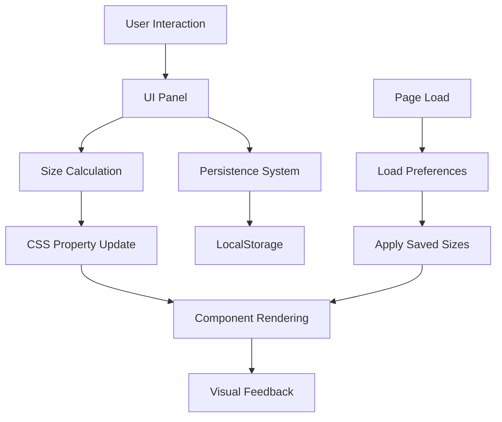

# HA-Fusion Size Customization System

## Overview

The HA-Fusion Size Customization System is a comprehensive UI panel-based solution that allows users to dynamically customize the size of dashboard components in real-time. This system provides an intuitive interface for adjusting component sizes without requiring technical knowledge of CSS or JavaScript.

## Table of Contents

1. [Features](#features)
2. [System Architecture](#system-architecture)
3. [User Interface](#user-interface)
4. [Configuration](#configuration)
5. [Usage Guide](#usage-guide)
6. [Technical Implementation](#technical-implementation)
7. [API Reference](#api-reference)
8. [Customization Options](#customization-options)
9. [Troubleshooting](#troubleshooting)
10. [Performance Considerations](#performance-considerations)

## Features

### Core Features

- **Floating UI Panel**: Modern, semi-transparent overlay with smooth animations
- **Preset Size Options**: Quick selection buttons (Small, Medium, Large, XL)
- **Real-time Slider**: Live preview with smooth transitions
- **Custom Input Field**: Precise pixel value entry (30-150px range)
- **Component-Specific Overrides**: Individual controls for different component types
- **Persistent Storage**: Automatically saves and restores user preferences
- **Keyboard Support**: Full keyboard navigation and shortcuts
- **Desktop-First Design**: Optimized for desktop interaction

### Advanced Features

- **Live Preview**: Instant visual feedback during size adjustments
- **Smooth Animations**: CSS transitions for professional appearance
- **Visual Notifications**: Confirmation messages for user actions
- **Responsive Design**: Adapts to different screen sizes
- **Accessibility Support**: ARIA labels and keyboard navigation
- **Error Handling**: Graceful fallbacks and validation

## System Architecture

### Component Structure

```
Size Customization System
├── Toggle Button (Floating)
├── Main Panel
│   ├── Header (Title + Close Button)
│   ├── Preset Section (Quick Size Buttons)
│   ├── Slider Section (Real-time Adjustment)
│   ├── Input Section (Precise Values)
│   ├── Override Section (Component-Specific)
│   └── Action Buttons (Reset + Apply)
├── CSS Injection System
├── Event Management
└── Persistence Layer
```

### Data Flow



## User Interface

### Panel Layout

The size customization panel is positioned as a floating overlay on the right side of the screen, featuring:

#### Header Section
- **Title**: "Size Customization"
- **Close Button**: X button with hover effects
- **Background**: Semi-transparent with blur effect

#### Preset Section
- **Quick Buttons**: Small (45px), Medium (61.35px), Large (80px), XL (100px)
- **Active State**: Highlighted button showing current selection
- **Grid Layout**: 2x2 button arrangement for easy access

#### Slider Section
- **Range Slider**: 30px to 150px with 0.5px increments
- **Live Value Display**: Shows current size in pixels
- **Range Labels**: Min/max values displayed below slider
- **Real-time Preview**: Changes apply immediately during dragging

#### Input Section
- **Number Input**: Direct pixel value entry
- **Validation**: Automatic clamping to valid range
- **Suffix Label**: "px" indicator for clarity
- **Styled Container**: Consistent with panel design

#### Component Override Section
- **Button Override**: Specific sizing for button components
- **Sidebar Override**: Specific sizing for sidebar items
- **Individual Sliders**: Per-component adjustment controls
- **Value Display**: Current override values shown

#### Action Section
- **Reset Button**: Restore default sizes
- **Apply Button**: Save changes and close panel
- **Confirmation**: Visual feedback for successful operations

### Visual Design

#### Color Scheme
- **Background**: `rgba(0, 0, 0, 0.9)` with blur effect
- **Text**: White with various opacity levels
- **Accent**: `#4a90e2` for active states and sliders
- **Borders**: `rgba(255, 255, 255, 0.1)` for subtle separation

#### Typography
- **Font Family**: Inter, system-ui, sans-serif
- **Header**: 18px, weight 600
- **Labels**: 14px, weight 500
- **Values**: 12-14px, various weights

#### Animations
- **Panel Show/Hide**: 300ms cubic-bezier transition
- **Size Changes**: Smooth transitions with easing
- **Hover Effects**: 200ms ease transitions
- **Button States**: Instant feedback with smooth transitions

## Configuration

### Prerequisites

The size customization system requires custom JavaScript to be enabled in the HA-Fusion configuration:

```yaml
# data/configuration.yaml
locale: en
custom_js: true
```

### File Structure

```
data/
├── configuration.yaml     # Enable custom_js: true
└── custom_javascript.js   # Size customization system
```

### System Requirements

- **Browser Support**: Modern browsers with ES6+ support
- **JavaScript**: Must be enabled
- **LocalStorage**: Required for preference persistence
- **CSS Custom Properties**: For dynamic styling

## Usage Guide

### Accessing the Panel

#### Toggle Button
1. **Location**: Fixed position in top-right corner
2. **Appearance**: Circular button with size adjustment icon
3. **Hover Effect**: Scales to 110% with background change
4. **Click**: Opens/closes the size customization panel

#### Keyboard Shortcut
- **Shortcut**: `Ctrl + Shift + S`
- **Function**: Toggle panel visibility
- **Scope**: Global (works anywhere on the page)

### Using Preset Sizes

1. **Open Panel**: Click toggle button or use keyboard shortcut
2. **Select Preset**: Click desired size button (Small/Medium/Large/XL)
3. **Instant Apply**: Size changes immediately with smooth animation
4. **Visual Feedback**: Active button highlighted in blue

### Custom Size Adjustment

#### Using the Slider
1. **Drag Slider**: Move thumb to desired position
2. **Live Preview**: Size updates in real-time during dragging
3. **Value Display**: Current size shown above slider
4. **Release**: Final size applied when mouse released

#### Using Direct Input
1. **Click Input Field**: Focus on number input
2. **Enter Value**: Type desired pixel value (30-150)
3. **Validation**: Value automatically clamped to valid range
4. **Apply**: Press Enter or click outside field

### Component-Specific Overrides

1. **Access Overrides**: Scroll to "Component Specific" section
2. **Adjust Components**: Use individual sliders for buttons/sidebar
3. **Independent Control**: Each component type sized separately
4. **Value Display**: Current override values shown in real-time

### Saving and Resetting

#### Apply Changes
- **Apply Button**: Saves preferences and closes panel
- **Auto-Save**: Changes saved automatically during adjustment
- **Confirmation**: Success notification displayed

#### Reset to Default
- **Reset Button**: Restores original 61.35px size
- **Clears Overrides**: Removes all component-specific settings
- **Immediate Effect**: Changes apply instantly

### Keyboard Navigation

- **Tab**: Navigate between controls
- **Enter**: Activate buttons or apply input values
- **Arrow Keys**: Adjust slider values (when focused)
- **Escape**: Close panel
- **Space**: Activate focused buttons

## Technical Implementation

### Core System

The size customization system is implemented as a self-contained JavaScript module with the following key components:

#### Global Namespace
```javascript
window.HAFusionSizeCustomizer = {
    config: { /* Configuration options */ },
    state: { /* Runtime state */ },
    init: function() { /* Initialization */ },
    // ... other methods
};
```

#### Configuration Object
```javascript
config: {
    defaultSize: 61.35,        // Default component size
    minSize: 30,               // Minimum allowed size
    maxSize: 150,              // Maximum allowed size
    presets: {                 // Preset size definitions
        small: 45,
        medium: 61.35,
        large: 80,
        xl: 100
    },
    storageKey: 'ha-fusion-size-preferences',
    animationDuration: 300
}
```

#### State Management
```javascript
state: {
    currentSize: 61.35,        // Current global size
    panelVisible: false,       // Panel visibility state
    isInitialized: false,      // Initialization flag
    componentOverrides: {}     // Component-specific sizes
}
```

### CSS Property System

The system uses CSS custom properties for dynamic styling:

```css
:root {
    --ha-fusion-item-height: 61.35px;
    --ha-fusion-button-height: 61.35px;
}
```

### Event Handling

#### Panel Events
- **Toggle Button Click**: Show/hide panel
- **Close Button Click**: Hide panel
- **Outside Click**: Auto-close panel
- **Escape Key**: Close panel

#### Control Events
- **Preset Buttons**: Immediate size application
- **Slider Input**: Real-time preview
- **Slider Change**: Final size application
- **Number Input**: Validated size setting
- **Component Sliders**: Override-specific sizing

#### Keyboard Events
- **Global Shortcut**: `Ctrl + Shift + S` for panel toggle
- **Navigation**: Tab, Enter, Arrow keys for control
- **Accessibility**: Full keyboard support

### Persistence System

#### Storage Format
```javascript
{
    currentSize: 75.5,
    componentOverrides: {
        button: 80,
        sidebar: 70
    },
    timestamp: 1704067200000
}
```

#### Storage Operations
- **Save**: Automatic on size changes
- **Load**: On system initialization
- **Validation**: Error handling for corrupted data
- **Fallback**: Default values if storage unavailable

### Animation System

#### Transition Classes
```css
.size-transition {
    transition: all 300ms cubic-bezier(0.4, 0, 0.2, 1) !important;
}
```

#### Animation Timing
- **Size Changes**: 300ms with easing
- **Panel Show/Hide**: 300ms cubic-bezier
- **Hover Effects**: 200ms ease
- **Button States**: Instant with smooth transitions

## API Reference

### Main Methods

#### `init()`
Initializes the size customization system.

```javascript
window.HAFusionSizeCustomizer.init();
```

**Returns**: `void`
**Side Effects**: Creates UI elements, sets up event listeners

#### `setSize(size)`
Sets the global component size.

```javascript
window.HAFusionSizeCustomizer.setSize(75);
```

**Parameters**:
- `size` (number): Size in pixels (30-150)

**Returns**: `void`
**Side Effects**: Updates UI, applies sizing, saves preferences

#### `applySizing(size, isPreview)`
Applies sizing to dashboard components.

```javascript
window.HAFusionSizeCustomizer.applySizing(80, false);
```

**Parameters**:
- `size` (number): Size in pixels
- `isPreview` (boolean): Whether this is a preview (no transitions)

**Returns**: `void`
**Side Effects**: Updates component styles

#### `togglePanel()`
Toggles the visibility of the size customization panel.

```javascript
window.HAFusionSizeCustomizer.togglePanel();
```

**Returns**: `void`
**Side Effects**: Shows/hides panel with animation

#### `resetToDefault()`
Resets all sizes to default values.

```javascript
window.HAFusionSizeCustomizer.resetToDefault();
```

**Returns**: `void`
**Side Effects**: Clears overrides, applies default size

### Configuration Properties

#### `config.defaultSize`
Default component size in pixels.
- **Type**: `number`
- **Default**: `61.35`
- **Range**: `30-150`

#### `config.presets`
Predefined size options.
- **Type**: `object`
- **Structure**: `{ name: size }`
- **Example**: `{ small: 45, medium: 61.35 }`

#### `config.storageKey`
LocalStorage key for preferences.
- **Type**: `string`
- **Default**: `'ha-fusion-size-preferences'`

### State Properties

#### `state.currentSize`
Current global component size.
- **Type**: `number`
- **Range**: `30-150`
- **Updates**: Automatically on size changes

#### `state.componentOverrides`
Component-specific size overrides.
- **Type**: `object`
- **Structure**: `{ componentType: size }`
- **Example**: `{ button: 80, sidebar: 70 }`

## Customization Options

### Preset Modification

To modify preset sizes, edit the configuration:

```javascript
window.HAFusionSizeCustomizer.config.presets = {
    tiny: 35,
    small: 50,
    medium: 65,
    large: 85,
    huge: 120
};
```

### Size Range Adjustment

To change the allowed size range:

```javascript
window.HAFusionSizeCustomizer.config.minSize = 25;
window.HAFusionSizeCustomizer.config.maxSize = 200;
```

### Animation Timing

To adjust animation duration:

```javascript
window.HAFusionSizeCustomizer.config.animationDuration = 500;
```

### Component Selectors

To target additional component types:

```javascript
// Add to getComponentSelector method
getComponentSelector(component) {
    const selectors = {
        button: '.button, [class*="button"]',
        sidebar: '#sidebar .item, .sidebar-item',
        card: '.card, .dashboard-card',  // New component type
        widget: '.widget, .dashboard-widget'  // New component type
    };
    return selectors[component] || '';
}
```

### Styling Customization

#### Panel Colors
```css
#size-customizer-panel {
    background-color: rgba(20, 20, 20, 0.95) !important;
    border: 1px solid rgba(100, 100, 100, 0.3) !important;
}
```

#### Button Styling
```css
#size-customizer-panel .preset-btn {
    background: linear-gradient(135deg, #667eea 0%, #764ba2 100%) !important;
    border: none !important;
}
```

#### Slider Styling
```css
#size-customizer-panel input[type="range"]::-webkit-slider-thumb {
    background: linear-gradient(135deg, #ff6b6b, #ee5a24) !important;
}
```

## Troubleshooting

### Common Issues

#### Panel Not Appearing
**Symptoms**: Toggle button visible but panel doesn't open
**Causes**:
- JavaScript errors in console
- CSS conflicts with existing styles
- Z-index issues

**Solutions**:
1. Check browser console for errors
2. Verify custom JavaScript is enabled
3. Clear browser cache and reload
4. Check for CSS conflicts

#### Size Changes Not Applying
**Symptoms**: Slider moves but components don't resize
**Causes**:
- CSS specificity conflicts
- Component styles overriding custom properties
- Missing transition classes

**Solutions**:
1. Inspect element styles in developer tools
2. Check for `!important` declarations
3. Verify CSS custom properties are set
4. Clear browser cache

#### Preferences Not Saving
**Symptoms**: Settings reset on page reload
**Causes**:
- LocalStorage disabled or full
- Browser privacy settings
- Storage quota exceeded

**Solutions**:
1. Check browser storage settings
2. Clear LocalStorage data
3. Verify storage permissions
4. Test in incognito mode

#### Performance Issues
**Symptoms**: Lag during size adjustments
**Causes**:
- Too many DOM elements
- Heavy CSS transitions
- Memory leaks

**Solutions**:
1. Reduce animation duration
2. Limit concurrent transitions
3. Check for memory leaks
4. Optimize CSS selectors

### Debug Mode

To enable debug logging:

```javascript
// Add to browser console
window.HAFusionSizeCustomizer.debug = true;
```

This will output detailed information about:
- Size calculations
- Event handling
- Storage operations
- Performance metrics

### Browser Compatibility

#### Supported Browsers
- **Chrome**: 60+
- **Firefox**: 55+
- **Safari**: 12+
- **Edge**: 79+

#### Required Features
- ES6 Classes and Arrow Functions
- CSS Custom Properties
- LocalStorage API
- Modern Event Handling

#### Fallbacks
- Graceful degradation for older browsers
- Feature detection for critical APIs
- Alternative storage methods if LocalStorage unavailable

## Performance Considerations

### Optimization Strategies

#### DOM Manipulation
- **Batch Updates**: Group style changes together
- **RequestAnimationFrame**: Use for smooth animations
- **Event Delegation**: Minimize event listeners
- **Debouncing**: Limit rapid successive calls

#### Memory Management
- **Event Cleanup**: Remove listeners on destroy
- **Object References**: Avoid circular references
- **Garbage Collection**: Clear unused variables
- **Storage Limits**: Monitor LocalStorage usage

#### CSS Performance
- **Efficient Selectors**: Use specific, fast selectors
- **Transform Properties**: Prefer transform over layout changes
- **Will-Change**: Hint browser for optimizations
- **Composite Layers**: Promote elements to GPU

### Performance Metrics

#### Initialization Time
- **Target**: < 100ms
- **Measurement**: Time from init() call to ready state
- **Optimization**: Lazy loading, minimal DOM queries

#### Size Change Response
- **Target**: < 16ms (60fps)
- **Measurement**: Time from user input to visual update
- **Optimization**: CSS transitions, efficient selectors

#### Memory Usage
- **Target**: < 5MB additional
- **Measurement**: Browser memory profiler
- **Optimization**: Object pooling, cleanup routines

### Monitoring

#### Performance Tracking
```javascript
// Add performance monitoring
window.HAFusionSizeCustomizer.performance = {
    initTime: 0,
    sizeChangeTime: 0,
    memoryUsage: 0
};
```

#### Error Reporting
```javascript
// Add error tracking
window.HAFusionSizeCustomizer.errors = [];
window.addEventListener('error', (e) => {
    if (e.filename.includes('custom_javascript')) {
        window.HAFusionSizeCustomizer.errors.push(e);
    }
});
```

## Conclusion

The HA-Fusion Size Customization System provides a comprehensive, user-friendly solution for dynamic component sizing. With its intuitive UI panel, real-time preview capabilities, and robust persistence system, users can easily customize their dashboard appearance without technical expertise.

The system is designed with performance, accessibility, and extensibility in mind, making it suitable for both casual users and advanced customization scenarios. Regular monitoring and maintenance ensure optimal performance and user experience.

For additional support or feature requests, refer to the main HA-Fusion documentation or community resources.